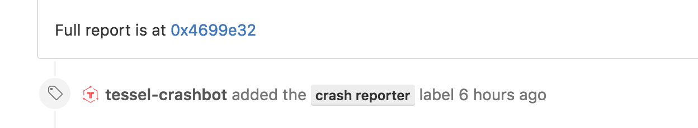

### The Tessel Crash Reporter service

The Tessel 2 [crash reporter](http://crash-reporter.tessel.io) is a web service which automatically collects anonymized crash reports when a crash is detected in the Tessel 2's command line interface (CLI). Given that the CLI is one of the primary ways of interacting with your Tessel it is important that the CLI be extremely stable and a joy to use.

This project started during the early days of the CLI. We wanted to make sure that the team was proactively looking at, and fixing issues that users could potentially run into. We wanted the onboarding experience was as smooth as possible for new users.

#### How does it work

Every time you use the Tessel 2 CLI, a central controller dispatches your command to an appropriate task handler. The crash reporter automatically checks for uncaught `Errors` and unresolved `Promises` in the node process that's executing the task. 

Once the crash reporter detects a crash, it removes all PII (personally identifiable information) from the stack trace, and uploads it to the Crash reporter web service with the user's permission. Below is an example of what that interaction looks like:

```javascript
ERR! Detected CLI crash [Error: Testing the crash reporter] Error: Testing the crash reporter
    at CrashReporter.off.CrashReporter.on.CrashReporter.sanitize.CrashReporter.sanitize.redactions.CrashReporter.prompt.CrashReporter.submit.CrashReporter.prompt.then.CrashReporter.post.CrashReporter.status.CrashReporter.test (/Users/rahulrav/Workspaces/Tessel2/CLI/lib/crash-reporter.js:177:25)
    at process._tickCallback (node.js:406:9)
    at Function.Module.runMain (module.js:449:11)
    at startup (node.js:141:18)
    at node.js:933:3
INFO Detected a crash in the CLI. Submit crash (y/n) ?
   If yes(y), subsequent crashes will be submitted automatically.
```

#### The service

The Crash reporter web service collects the crash report, and de-duplicates it using the Sim Hash algorithm. Sim Hash looks at the contents of the crash report and computes a unique signature (called the `fingerprint`) and also keeps track of the `frequency` of the occurence of the report. The service also provides a way to look at `Trending` crashes and also provides a full text `Search` API. The service itself is built using [Google App Engine](https://cloud.google.com/appengine/docs) and the Python Runtime. The full source code for the service is [here](https://github.com/tessel/t2-crash-reporter). 

#### Hi from tessel-crashbot

[Recently](https://github.com/tessel/t2-crash-reporter/issues/15) we landed a really cool feature in the Crash reporter service. In an effort to simplify the worflow of the Tessel team, which manages all feature requests and bug-fixes using GitHub [issues](https://github.com/tessel/t2-cli/issues); the service uses GitHub's API to automatically create and manage issues for every crash report. Anytime there is a new crash in the wild, the ever friendly 
`tessel-crashbot` is ready to help proactively keep track of the problem. 

.


